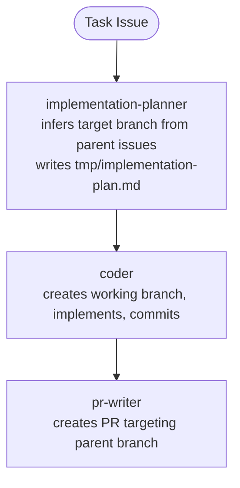
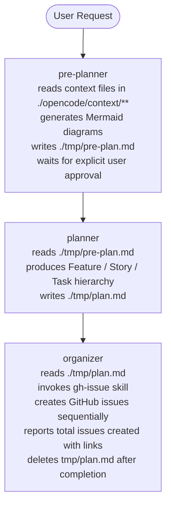
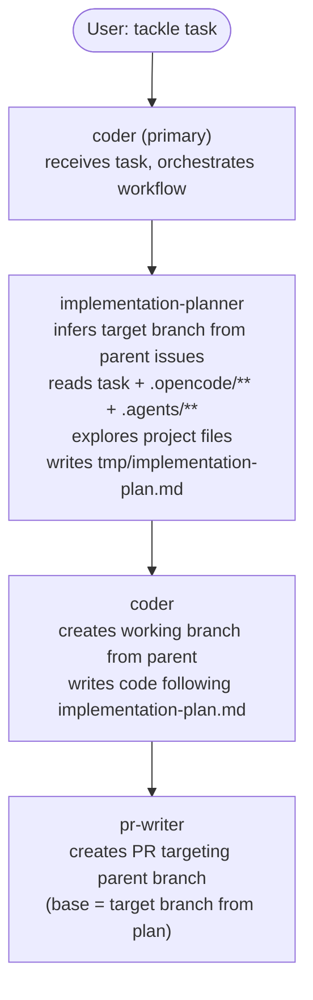

# PROJECT SUMMARY

generated: 2026-03-21
repo: https://github.com/iapicca/opencode_assets

---

## Purpose

This is a personal OpenCode workflow toolkit — **not a code project**.
There are no source files, build steps, lint rules, or test suites.
Its sole purpose is to hold reusable OpenCode configuration: agents, skills, and GitHub issue templates.

Consumers install it by copying the `root/` directory into their working project.

---

## Goals

- Automate the translation of a user request into a structured agile plan.
- Automate the creation of GitHub issues from that plan using consistent formatting.
- Reduce token cost by offloading lightweight reasoning tasks to a local LLM (Ollama).

---

## Directory Structure

```
.agents/                                 # Agent-facing documentation for AI context (NOT installed)
│   ├── opencode-agent-summary.md        # OpenCode agent system reference
│   ├── opencode-skills-summary.md       # OpenCode skills system reference
│   └── project-summary.md              # This file: project conventions and pipeline docs
│
root/                                    # Installation payload: copied to user's project root
├── opencode.json                        # OpenCode CLI config (models, providers, agent overrides)
└── .opencode/
    ├── agents/                          # Agent definitions (installed to .opencode/agents/)
    │   ├── pre-planner.md               # Subagent: context scan + pre-plan generation
    │   ├── planner.md                   # Subagent: agile plan generation
    │   ├── organizer.md                 # Subagent: GitHub issue creation
    │   ├── implementation-planner.md    # Subagent: reads task → writes tmp/implementation-plan.md
    │   ├── pr-writer.md                 # Subagent: commits changes + creates PR
    │   └── coder.md                     # Primary agent: orchestrates implementation workflow
    ├── skills/                          # Skill definitions (installed to .opencode/skills/)
    │   ├── gh-issue/SKILL.md            # Skill: creates GitHub issues via gh CLI
    │   ├── tmp-file/SKILL.md            # Skill: writes .md files to ./tmp
    │   ├── git-commit/SKILL.md          # Skill: creates meaningful git commits
    │   └── pr-create/SKILL.md           # Skill: creates PRs via gh CLI
    └── templates/github/
        ├── feature.md                   # GitHub issue template: [FEATURE]
        ├── story.md                     # GitHub issue template: [Story]
        ├── task.md                      # GitHub issue template: [Task]
        └── pr.md                        # PR description template

tmp/                                     # Scratch space (gitignored); runtime agents write here
```

**Key distinction**: `.agents/` contains documentation for AI context only and is never installed. `root/.opencode/` contains the actual agents, skills, and templates that get copied to the user's project root during installation.

> **Note on agent naming**: When the Coder Pipeline references `implementation-planner`, it means the agent defined at `root/.opencode/agents/implementation-planner.md`. That agent's output is always written to `tmp/implementation-plan.md` — the plan is not a separate source file.

---

## Branch Strategy

```
main/master
└── feature/<feature-issue>-<slug>          # Branched from main
    └── story/<story-issue>-<slug>          # Branched from feature
        └── task/<task-issue>-<slug>        # Branched from story
```

### Rules

1. **Never create PRs targeting `main/master` directly** — only feature branches merge into main
2. **Every Feature/Epic** has its own branch based on `main/master`
3. **Every Story** has its own branch based on its parent Feature's branch
4. **Every Task's PR** targets the parent Story's branch
5. **Story branch merges to Feature branch** only when all child Tasks are resolved (no open PRs/issues)
6. **Feature branch merges to main/master** only when all child Stories are resolved (upon user approval)

### Branch Naming Convention

| Issue Type | Working Branch | Target Branch |
|---|---|---|
| Feature | `feature/<issue>-<slug>` | `main` |
| Story | `story/<issue>-<slug>` | `feature/<parent-issue>-<slug>` |
| Task | `task/<issue>-<slug>` | `story/<parent-issue>-<slug>` |

### Implementation Flow



---

## Agent Pipeline (Planning Flow)



All agents are `mode: subagent`. They are invoked by the primary agent via the Task tool or via `@mention`.

---

## Coder Agent Pipeline (Implementation Flow)



The `coder` agent is the primary agent users interact with for implementation tasks. It delegates to `implementation-planner` for planning and `pr-writer` for finalization.

---

## Model Assignments

| Agent                | Model               | Reason                              |
|----------------------|---------------------|--------------------------------------|
| pre-planner          | opencode/big-pickle | Lightweight; context scan only       |
| planner              | minimax/minimax-m2.7 | Needs strong structured output    |
| organizer            | opencode/big-pickle | Lightweight; template formatting     |
| implementation-planner| opencode/big-pickle | Lightweight; follows implementation-plan.md |
| pr-writer            | opencode/big-pickle | Lightweight; commit formatting       |
| coder                | minimax/minimax-m2.7 | Primary agent; orchestration     |

OpenCode Zen provider is configured at `https://opencode.ai/zen/v1/chat/completions` via `@ai-sdk/openai-compatible`.
The model `big-pickle` is a free stealth model provided by OpenCode Zen.

---

## Skills

### `gh-issue`
- **Trigger**: when creating GitHub issues from a structured plan.
- **Convention**: only runs `gh *` commands; no arbitrary bash.
- **Workflow**: detect repo → load templates → create issues with `[Feature]`/`[Story]`/`[Task]` prefixes.
- **Requirement**: `gh` CLI must be authenticated.

### `tmp-file`
- **Trigger**: when an agent needs to write a temporary `.md` file to `./tmp`.
- **Convention**: only runs `mkdir -p *` commands; all other bash is avoided.
- **Workflow**: `mkdir -p ./tmp` → write file.

### `git-commit`
- **Trigger**: when committing changes with a meaningful message.
- **Convention**: follows commit message format in `.opencode/templates/commit.md` or uses conventional commits.
- **Workflow**: stage changes → read conventions → create commit with meaningful message.
- **Requirement**: git repository with configured user.

### `pr-create`
- **Trigger**: when creating a pull request after commit.
- **Convention**: reads PR template from `.opencode/templates/github/pr.md`.
- **Workflow**: detect repo → load template → create PR via `gh pr create`.
- **Requirement**: `gh` CLI must be authenticated.

---

## GitHub Issue Templates

All three templates (`feature.md`, `story.md`, `task.md`) share the same section structure:

| Section | Purpose |
|---|---|
| Metadata | Target component, LLM context hints |
| Executive Summary | 1-2 sentence goal + value proposition |
| User Story | As a / I want to / So that |
| Functional Requirements | Checkbox bullet list |
| Acceptance Criteria | Given/When/Then format |
| Technical Implementation Details | Files, data model changes, dependencies |
| Definition of Done | Final checklist |
| Related links | Parent/child issue URLs |

Title prefixes: `[FEATURE]`, `[Story]`, `[Task]`

Template frontmatter schema:
```yaml
---
name: "<Template Name>"
about: "<Description>"
title: "[PREFIX] <Title>"
---
```

---

## Agent & Skill Conventions

### Agent YAML Frontmatter

```yaml
---
description: <short description>
mode: <subagent|mainagent>
permission:
  task:
    "<skill-name>": allow
  bash:
    "<pattern>": <allow|deny|ask>
    "<pattern>": <allow|deny|ask>
    "*": deny
---
```

### Skill YAML Frontmatter

Supported attributes: `name`, `description`, `argument-hint`, `compatibility`, `disable-model-invocation`, `license`, `metadata`, `user-invocable`.

> **Note**: `permission` is **not** supported in skill files. Bash and write restrictions belong in the calling agent's frontmatter, not in the skill.

```yaml
---
name: <skill-name>
description: <what the skill does>
---
```

### Agent Instruction Style
- All agents start with: `You are the <Role> agent.`
- Sequential steps go under `## Workflow` using numbered lists.
- Restrictions go under `## Constraints` using bullet points.
- Agents write intermediate output to `./tmp` using the `tmp-file` skill.
- No agent has broad bash access; permissions are scoped to the minimum required commands.

### File Naming
- Agent files: lowercase with hyphens (e.g., `pre-planner.md`)
- Skill directories: lowercase with hyphens (e.g., `gh-issue/`)
- Template files: lowercase with hyphens (e.g., `feature.md`)

### Markdown Formatting
- Use ATX-style headers (`##` not `===`)
- Use code fences with language hints for examples
- Use `**bold**` for emphasis in instructions
- Use `> blockquotes` for important notes
- Maximum line length: 120 characters

### YAML Frontmatter Style
- 2-space indentation
- Always quote strings containing special characters
- Use lowercase for boolean values
- Separate frontmatter from content with a blank line

---

## Context Scanning

When analyzing project context (pre-planner):
1. Find `.md` files in `./opencode/context/**`
2. Use grep to search for relevant keywords
3. Extract only relevant sections, not entire files
4. Prioritize: core system definitions, business domain, technical domain, architectural decisions

---

## Runtime Requirements

- OpenCode CLI installed
- Git repository with a configured remote (`origin`)
- `gh` CLI authenticated (`gh auth status`)
- Git user configured (`git config user.name` and `git config user.email`)
- OpenCode Zen account with API key for `big-pickle` model

---

## What Agents Should NOT Do in This Repo

- Do not create, edit, or delete source code files (there are none).
- Do not run build, lint, or test commands (none exist).
- Do not modify `root/opencode.json` unless explicitly instructed.
- Do not write outside `./tmp` without user approval.
