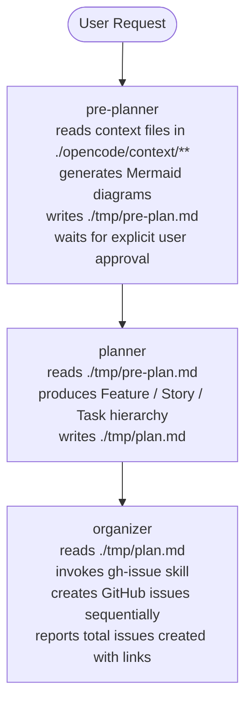

# PROJECT SUMMARY

generated: 2026-03-21
repo: https://github.com/iapicca/opencode_assets

---

## Purpose

This is a personal OpenCode workflow toolkit — **not a code project**.
There are no source files, build steps, lint rules, or test suites.
Its sole purpose is to hold reusable OpenCode configuration: agents, skills, and GitHub issue templates.

Consumers install it by copying the `root/` directory into their working project.

---

## Goals

- Automate the translation of a user request into a structured agile plan.
- Automate the creation of GitHub issues from that plan using consistent formatting.
- Reduce token cost by offloading lightweight reasoning tasks to a local LLM (Ollama).

---

## Directory Structure

```
root/
├── opencode.json                        # OpenCode CLI config (models, providers, agent overrides)
└── .opencode/
    ├── agents/
    │   ├── pre-planner.md               # Subagent: context scan + pre-plan generation
    │   ├── planner.md                   # Subagent: agile plan generation
    │   └── organizer.md                 # Subagent: GitHub issue creation
    ├── skills/
    │   ├── gh-issue/SKILL.md            # Skill: creates GitHub issues via gh CLI
    │   └── tmp-file/SKILL.md            # Skill: writes .md files to ./tmp
    └── templates/github/
        ├── feature.md                   # GitHub issue template: [FEATURE]
        ├── story.md                     # GitHub issue template: [Story]
        └── task.md                      # GitHub issue template: [Task]

tmp/                                     # Scratch space (gitignored); runtime agents write here
.agents/                                 # Agent-facing documentation (this directory)
```

---

## Agent Pipeline



All agents are `mode: subagent`. They are invoked by the primary agent via the Task tool or via `@mention`.

---

## Model Assignments

| Agent       | Model                 | Reason                           |
|---|---|---|
| pre-planner | ollama/qwen3-7b       | Lightweight; context scan only   |
| planner     | minimax/minimax-m2.7  | Needs strong structured output   |
| organizer   | ollama/qwen3-7b       | Lightweight; template formatting |

Ollama provider is configured at `http://localhost:11434/v1` via `@ai-sdk/openai-compatible`.
The model alias `qwen3-7b` maps to a saved Ollama session (`/save qwen3-7b`).

---

## Skills

### `gh-issue`
- **Trigger**: when creating GitHub issues from a structured plan.
- **Convention**: only runs `gh *` commands; no arbitrary bash.
- **Workflow**: detect repo → load templates → create issues with `[Feature]`/`[Story]`/`[Task]` prefixes.
- **Requirement**: `gh` CLI must be authenticated.

### `tmp-file`
- **Trigger**: when an agent needs to write a temporary `.md` file to `./tmp`.
- **Convention**: only runs `mkdir -p *` commands; all other bash is avoided.
- **Workflow**: `mkdir -p ./tmp` → write file.

---

## GitHub Issue Templates

All three templates (`feature.md`, `story.md`, `task.md`) share the same section structure:

| Section | Purpose |
|---|---|
| Metadata | Target component, LLM context hints |
| Executive Summary | 1-2 sentence goal + value proposition |
| User Story | As a / I want to / So that |
| Functional Requirements | Checkbox bullet list |
| Acceptance Criteria | Given/When/Then format |
| Technical Implementation Details | Files, data model changes, dependencies |
| Definition of Done | Final checklist |
| Related links | Parent/child issue URLs |

Title prefixes: `[FEATURE]`, `[Story]`, `[Task]`

Template frontmatter schema:
```yaml
---
name: "<Template Name>"
about: "<Description>"
title: "[PREFIX] <Title>"
---
```

---

## Agent & Skill Conventions

### Agent YAML Frontmatter

```yaml
---
description: <short description>
mode: <subagent|mainagent>
permission:
  task:
    "<skill-name>": allow
  bash:
    "<pattern>": <allow|deny|ask>
    "*": <deny>
---
```

### Skill YAML Frontmatter

Supported attributes: `name`, `description`, `argument-hint`, `compatibility`, `disable-model-invocation`, `license`, `metadata`, `user-invocable`.

> **Note**: `permission` is **not** supported in skill files. Bash and write restrictions belong in the calling agent's frontmatter, not in the skill.

```yaml
---
name: <skill-name>
description: <what the skill does>
---
```

### Agent Instruction Style
- All agents start with: `You are the <Role> agent.`
- Sequential steps go under `## Workflow` using numbered lists.
- Restrictions go under `## Constraints` using bullet points.
- Agents write intermediate output to `./tmp` using the `tmp-file` skill.
- No agent has broad bash access; permissions are scoped to the minimum required commands.

### File Naming
- Agent files: lowercase with hyphens (e.g., `pre-planner.md`)
- Skill directories: lowercase with hyphens (e.g., `gh-issue/`)
- Template files: lowercase with hyphens (e.g., `feature.md`)

### Markdown Formatting
- Use ATX-style headers (`##` not `===`)
- Use code fences with language hints for examples
- Use `**bold**` for emphasis in instructions
- Use `> blockquotes` for important notes
- Maximum line length: 120 characters

### YAML Frontmatter Style
- 2-space indentation
- Always quote strings containing special characters
- Use lowercase for boolean values
- Separate frontmatter from content with a blank line

---

## Context Scanning

When analyzing project context (pre-planner):
1. Find `.md` files in `./opencode/context/**`
2. Use grep to search for relevant keywords
3. Extract only relevant sections, not entire files
4. Prioritize: core system definitions, business domain, technical domain, architectural decisions

---

## Runtime Requirements

- OpenCode CLI installed
- Git repository with a configured remote (`origin`)
- `gh` CLI authenticated (`gh auth status`)
- Ollama running locally with `qwen3-7b` model saved (`ollama run qwen3-coder:7b` → `/save qwen3-7b`)

---

## What Agents Should NOT Do in This Repo

- Do not create, edit, or delete source code files (there are none).
- Do not run build, lint, or test commands (none exist).
- Do not modify `root/opencode.json` unless explicitly instructed.
- Do not write outside `./tmp` without user approval.
