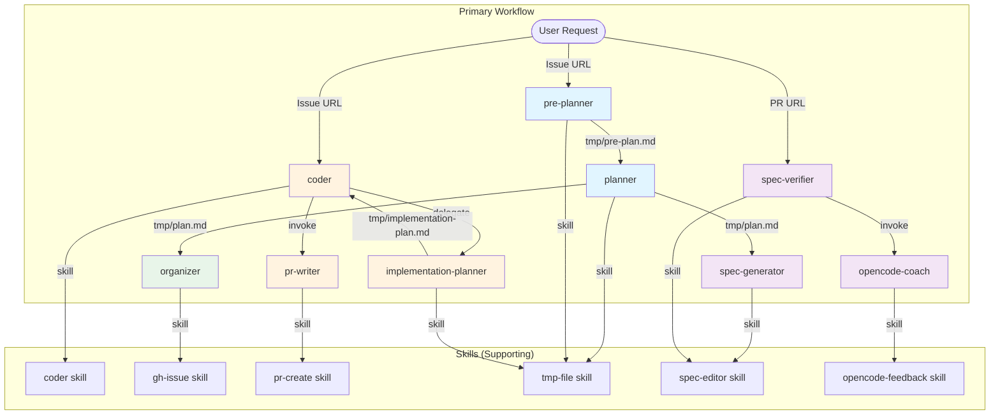

# OpenCode Bootstrap Agents & Skills Documentation

## Project Overview

The `./root/` directory serves as an **exportable bootstrap template** for OpenCode projects. It contains a complete, production-ready configuration that can be copied to bootstrap new repositories with a structured agent-based development workflow.

### Directory Structure

```
root/.opencode/
├── agents.md              # Permission convention documentation
├── agents/                # 9 agent definitions
│   ├── coder.md
│   ├── implementation-planner.md
│   ├── opencode-coach.md
│   ├── organizer.md
│   ├── planner.md
│   ├── pr-writer.md
│   ├── pre-planner.md
│   ├── spec-generator.md
│   └── spec-verifier.md
├── skills/                # 7 skill definitions
│   ├── coder/
│   ├── gh-issue/
│   ├── git-commit/
│   ├── opencode-feedback/
│   ├── pr-create/
│   ├── spec-editor/
│   └── tmp-file/
└── templates/             # Template files for issues, PRs, specs
    ├── github/
    ├── specs/
    └── implementation-plan.md
```

---

## Agent Workflow Diagram



---

## Agent Summary Table

| Agent | Mode | Primary Role | Key Output | Invokes |
|-------|------|--------------|------------|---------|
| `pre-planner` | subagent | Analyzes requests, scans context, generates pre-plans with diagrams | `tmp/pre-plan.md` | `tmp-file` |
| `planner` | primary | Transforms pre-plans into agile Feature/Story/Task hierarchy | `tmp/plan.md` | `tmp-file` |
| `organizer` | subagent | Creates GitHub issues from plan | GitHub Issues | `gh-issue` |
| `spec-generator` | subagent | Creates/updates spec documentation | `.opencode/specs/*.md` | `spec-editor` |
| `coder` | primary | Implements tasks from issues | Code changes | `implementation-planner`, `pr-writer`, `coder` skill |
| `implementation-planner` | subagent | Creates detailed implementation plans | `tmp/implementation-plan.md` | `tmp-file` |
| `pr-writer` | subagent | Commits changes, creates PRs | Pull Request | `pr-create` |
| `spec-verifier` | primary | Verifies specs against PR implementation | Updated specs | `spec-editor`, `opencode-coach` |
| `opencode-coach` | subagent | Analyzes PRs, proposes improvements to opencode_assets | GitHub Issues | `opencode-feedback` |

---

## Deep-Dive Analysis

### 1. Pre-Planner Agent (`pre-planner.md`)

| Attribute | Value |
|-----------|-------|
| **File** | `root/.opencode/agents/pre-planner.md` |
| **Mode** | `subagent` |
| **Model** | Inherits from primary agent |
| **Temperature** | Not specified (uses model default) |

**Purpose:** Analyzes user requests, scans project context, and generates structured pre-plans with visual Mermaid diagrams.

**Inputs:**
- User's natural language request
- Context files from `./opencode/context/**`
- Project structure

**Outputs:**
- `tmp/pre-plan.md` containing:
  - Goal, Scope, Key Requirements, Success Criteria
  - Mermaid diagrams for pre-plan structure and component interactions

**Triggers:**
- Invoked by user when starting a new feature/enhancement
- Waits for explicit user approval before invoking `planner`

**Permissions:**
```yaml
bash:
  "mkdir -p ./tmp": allow
  "touch tmp/pre-plan.md": allow
  "echo \"\" > tmp/pre-plan.md": allow
  "echo \"\" >> tmp/pre-plan.md": allow
skill:
  "tmp-file": allow
```

---

### 2. Planner Agent (`planner.md`)

| Attribute | Value |
|-----------|-------|
| **File** | `root/.opencode/agents/planner.md` |
| **Mode** | `primary` |
| **Model** | Inherits from primary agent |

**Purpose:** Transforms pre-plans into comprehensive agile-style plans with Feature/Story/Task hierarchy.

**Inputs:**
- `tmp/pre-plan.md` from pre-planner

**Outputs:**
- `tmp/plan.md` containing:
  - Feature/Story/Task structure
  - For each item: Title, Description, Requirements, Dependencies, Acceptance Criteria

**Triggers:**
- Invoked by pre-planner after user approval
- Uses `tmp-file` skill for file operations

**Permissions:**
```yaml
bash:
  "mkdir -p ./tmp": allow
  "touch tmp/plan.md": allow
  "echo \"\" > tmp/plan.md": allow
  "echo \"\" >> tmp/plan.md": allow
skill:
  "tmp-file": allow
```

---

### 3. Organizer Agent (`organizer.md`)

| Attribute | Value |
|-----------|-------|
| **File** | `root/.opencode/agents/organizer.md` |
| **Mode** | `subagent` |
| **Model** | Inherits from primary agent |

**Purpose:** Parses the plan and creates GitHub issues for each Feature, Story, and Task.

**Inputs:**
- `tmp/plan.md` from planner
- Templates from `.opencode/templates/github/` (feature.md, story.md, task.md)
- Model info from `opencode.json`

**Outputs:**
- GitHub Issues created sequentially
- Summary report with issue counts and links

**Triggers:**
- Invoked after planner creates `tmp/plan.md`
- Uses `gh-issue` skill for GitHub operations

**Permissions:**
```yaml
bash:
  "gh issue *": allow
  "git remote get-url *": allow
skill:
  "gh-issue": allow
```

---

### 4. Spec-Generator Agent (`spec-generator.md`)

| Attribute | Value |
|-----------|-------|
| **File** | `root/.opencode/agents/spec-generator.md` |
| **Mode** | `subagent` |
| **Model** | Inherits from primary agent |

**Purpose:** Creates and updates spec documentation based on the plan before GitHub issues are created.

**Inputs:**
- `tmp/plan.md` from planner
- Templates from `.opencode/templates/specs/`

**Outputs:**
- `.opencode/specs/*.md` files:
  - `project-vision.md` — new goals/purpose
  - `tech-stack.md` — new technologies
  - `architecture.md` — system design changes
  - `coding-standards.md` — new conventions
  - `project-structure.md` — organizational changes

**Triggers:**
- Parallel to organizer after planner creates `tmp/plan.md`
- Preserves existing spec sections when updating

**Permissions:**
```yaml
bash:
  "mkdir -p .opencode/specs/": allow
  "touch .opencode/specs/*.md": allow
  "echo \"\" > .opencode/specs/*.md": allow
  "echo \"\" >> .opencode/specs/*.md": allow
edit:
  ".opencode/specs/*.md": allow
skill:
  "spec-editor": allow
```

---

### 5. Coder Agent (`coder.md`)

| Attribute | Value |
|-----------|-------|
| **File** | `root/.opencode/agents/coder.md` |
| **Mode** | `primary` |
| **Model** | Inherits from primary agent |

**Purpose:** Primary agent for implementing coding tasks from GitHub issues with detailed planning and PR creation.

**Inputs:**
- GitHub Issue URL (from user)
- `tmp/implementation-plan.md` (from implementation-planner)
- Spec files from `.opencode/specs/`

**Outputs:**
- Code modifications following implementation plan
- PR created by pr-writer

**Triggers:**
- Receives GitHub issue URL from user
- Delegates to `implementation-planner` for planning
- Invokes `pr-writer` after implementation

**Task Types Handled:**
- Bug Fix (`fix:` prefix)
- Feature Implementation (`feat:` prefix)
- Refactoring (`refactor:` prefix)

**Permissions:**
```yaml
permission:
  task:
    "implementation-planner": allow
    "pr-writer": allow
  skill:
    "coder": allow
  read:
    "tmp/implementation-plan.md": allow
    ".opencode/specs/*.md": allow
    "*": deny
  edit:
    ".opencode/**": deny
    "opencode.json": deny
    "*": allow
  write:
    ".opencode/**": deny
    "opencode.json": deny
    "*": allow
```

**Note:** Uses `coder` skill for detailed implementation guidance.

---

### 6. Implementation-Planner Agent (`implementation-planner.md`)

| Attribute | Value |
|-----------|-------|
| **File** | `root/.opencode/agents/implementation-planner.md` |
| **Mode** | `subagent` |
| **Model** | Inherits from primary agent |

**Purpose:** Creates detailed, actionable implementation plans enabling the coder to write code efficiently.

**Inputs:**
- GitHub Issue URL or PR comment URL (from coder)
- Issue details via `gh issue view` and `gh api`
- Context files from `.opencode/` and project files

**Outputs:**
- `tmp/implementation-plan.md` containing:
  - Task Summary, Source Issue, Issue Type
  - Branch Strategy (Working/Target/Parent branches)
  - Files to Read (max 20)
  - Files to Change
  - New Files
  - Implementation Steps with Tools to Use
  - Acceptance Criteria

**Triggers:**
- Invoked by coder agent via delegation
- Only writes to `./tmp/implementation-plan.md`

**Branch Naming Convention:**
| Issue Type | Working Branch | Target Branch | Parent Branch |
|------------|----------------|---------------|---------------|
| Task #42 "add login button" | `task/42-add-login-button` | `story/15-user-auth` | `feature/10-auth-system` |
| Story #23 "payment flow" | `story/23-payment-flow` | `feature/8-ecommerce` | `main` |
| Feature #5 "dark mode" | `feature/5-dark-mode` | `main` | N/A |

**Permissions:**
```yaml
bash:
  "mkdir -p ./tmp": allow
  "touch tmp/implementation-plan.md": allow
  "echo \"\" > tmp/implementation-plan.md": allow
  "echo \"\" >> tmp/implementation-plan.md": allow
skill:
  "tmp-file": allow
```

---

### 7. PR-Writer Agent (`pr-writer.md`)

| Attribute | Value |
|-----------|-------|
| **File** | `root/.opencode/agents/pr-writer.md` |
| **Mode** | `subagent` |
| **Model** | Inherits from primary agent |

**Purpose:** Commits changes with meaningful messages and creates well-formatted pull requests.

**Inputs:**
- `tmp/implementation-plan.md` (to understand intended changes)
- Actual changes via `git status` and `git diff`
- PR template from `.opencode/templates/github/pr.md`

**Outputs:**
- Git commit(s) with conventional commits format
- Pull Request with filled template

**Triggers:**
- Invoked by coder after implementation is complete

**Commit Message Format:**
Follows the [Conventional Commits v1.0.0 specification](https://www.conventionalcommits.org/en/v1.0.0/#specification):
- Format: `<type>: <short summary>`
- Types: `feat`, `fix`, `docs`, `refactor`, `test`, `chore`
- Be concise (under 50 chars) and describe the WHY, not just the WHAT

**Permissions:**
```yaml
bash:
  "git add *": allow
  "git commit *": allow
  "git status *": allow
  "git diff *": allow
  "git remote get-url *": allow
  "gh pr create *": allow
  "gh repo view *": allow
skill:
  "pr-create": allow
```

---

### 8. Spec-Verifier Agent (`spec-verifier.md`)

| Attribute | Value |
|-----------|-------|
| **File** | `root/.opencode/agents/spec-verifier.md` |
| **Mode** | `primary` |
| **Model** | Inherits from primary agent |

**Purpose:** Verifies and amends spec documentation against actual implementation after PR merge.

**Inputs:**
- PR URL (required - asks user if not provided)
- PR details via `gh pr view`, `gh pr diff`
- Related issues via `gh issue list --mention <author>`
- Current specs from `.opencode/specs/`

**Outputs:**
- Updated `.opencode/specs/*.md` files reflecting actual implementation
- Report of discrepancies found
- Optional: Issue in `iapicca/opencode_assets` via opencode-coach

**Triggers:**
- User provides PR URL after PR is merged
- Invokes `opencode-coach` subagent after verification

**Comparison Checklist:**
- Architecture: Code changes vs documented architecture
- Tech Stack: Dependencies/frameworks in code vs `tech-stack.md`
- Coding Standards: Implementation vs documented conventions
- Project Structure: New files vs documented structure
- Project Vision: PR alignment with stated goals

**Permissions:**
```yaml
bash:
  "gh pr view *": allow
  "gh issue list *": allow
  "git diff *": allow
  "mkdir -p .opencode/specs/": allow
  "touch .opencode/specs/*.md": allow
  "echo \"\" > .opencode/specs/*.md": allow
  "echo \"\" >> .opencode/specs/*.md": allow
edit:
  ".opencode/specs/*.md": allow
skill:
  "spec-editor": allow
task:
  "opencode-coach": allow
```

---

### 9. OpenCode-Coach Agent (`opencode-coach.md`)

| Attribute | Value |
|-----------|-------|
| **File** | `root/.opencode/agents/opencode-coach.md` |
| **Mode** | `subagent` |
| **Model** | Inherits from primary agent |

**Purpose:** Analyzes closed PRs and proposes meaningful improvements to the opencode_assets toolkit.

**Inputs:**
- PR URL and source repository name (from spec-verifier)
- PR details via `gh pr view`, `gh pr diff`
- Source repo specs from `{source_repo}/.opencode/specs/`
- opencode_assets toolkit files

**Outputs:**
- If improvements found: Issue created in `iapicca/opencode_assets`
- If no improvements: Simple notification message

**Triggers:**
- Invoked by spec-verifier after PR verification completes

**Permissions:**
```yaml
bash:
  "gh pr view *": allow
  "gh pr diff *": allow
  "gh issue list *": allow
  "git remote get-url *": allow
  "*": deny
edit:
  ".opencode/specs/**": allow
  "*": deny
skill:
  "opencode-feedback": allow
  "spec-editor": allow
```

---

## Skills Summary

### Skill Summary Table

| Skill | Location | Purpose | Bash Permissions Declared |
|-------|----------|---------|---------------------------|
| `coder` | `skills/coder/SKILL.md` | Generates code with spec awareness | None |
| `gh-issue` | `skills/gh-issue/SKILL.md` | Creates GitHub issues via gh cli | `gh issue *`, `git remote get-url *` |
| `git-commit` | `skills/git-commit/SKILL.md` | Creates meaningful git commits | None declared in frontmatter |
| `opencode-feedback` | `skills/opencode-feedback/SKILL.md` | Proposes improvements to opencode_assets | None declared in frontmatter |
| `pr-create` | `skills/pr-create/SKILL.md` | Creates PRs via gh cli | `gh pr create *`, `gh repo view *`, `git remote get-url *` |
| `spec-editor` | `skills/spec-editor/SKILL.md` | Edits spec documentation | `mkdir -p .opencode/specs/`, `touch .opencode/specs/*.md`, `echo "" > .opencode/specs/*.md`, `echo "" >> .opencode/specs/*.md` |
| `tmp-file` | `skills/tmp-file/SKILL.md` | Creates .md files in ./tmp | `mkdir -p ./tmp` |

---

## Templates Reference

### Issue Templates (`.opencode/templates/github/`)

| Template | Prefix | Purpose |
|----------|--------|---------|
| `feature.md` | `[Feature]` | High-level functionality |
| `story.md` | `[Story]` | User-facing functionality |
| `task.md` | `[Task]` | Technical work items |
| `opencode-improvement.md` | `[IMPROVEMENT]` | Proposing changes to opencode_assets |

### Spec Templates (`.opencode/templates/specs/`)

| Template | Purpose |
|----------|---------|
| `architecture.md` | System overview, data flow, ADRs |
| `coding-standards.md` | Code style, testing, git conventions |
| `project-structure.md` | Directory layout, modules, naming |
| `tech-stack.md` | Language, frameworks, dependencies |
| `project-vision.md` | Purpose, goals, success metrics |

### Other Templates

| Template | Purpose |
|----------|---------|
| `implementation-plan.md` | Detailed implementation plan for issues |
| `github/pr.md` | Pull request template |

---

*Documentation generated from analysis of `./root/.opencode/` against [Official OpenCode Documentation](https://opencode.ai/docs)*