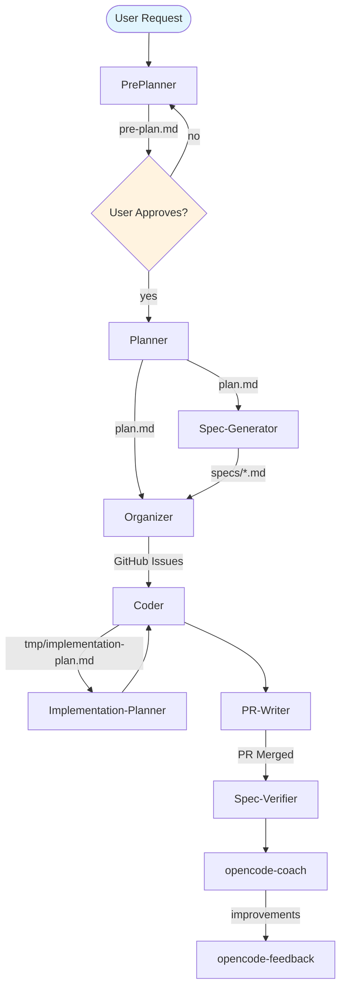

## What's this?

Personal [OpenCode](https://opencode.ai) workflow — a multi-agent system that transforms GitHub issues into implementation plans and pull requests through a structured, agile-inspired pipeline.

## Architecture



## Agent Roles

| Agent | Role |
|-------|------|
| **pre-planner** | Analyzes request, scans context, generates pre-plan with diagrams |
| **planner** | Converts pre-plan into Feature → Story → Task hierarchy |
| **spec-generator** | Creates/updates spec docs from plan |
| **organizer** | Creates GitHub issues from plan |
| **implementation-planner** | Creates detailed implementation plans for issues |
| **coder** | Implements code from implementation plan |
| **pr-writer** | Commits changes and creates PRs |
| **spec-verifier** | Verifies specs against merged PR |
| **opencode-coach** | Proposes improvements to this toolkit |

## Models

- `minimax/MiniMax-M2.7` — primary model for planning and coding
- `opencode/big-pickle` — used for resource-intensive subagents

## Requirements

- OpenCode CLI
- Git
- GitHub CLI (`gh`) authenticated

## Installation

```bash
git clone https://github.com/iapicca/opencode_assets /tmp/opencode_assets && \
cp -R /tmp/opencode_assets/root . && \
rm -rf /tmp/opencode_assets
```
